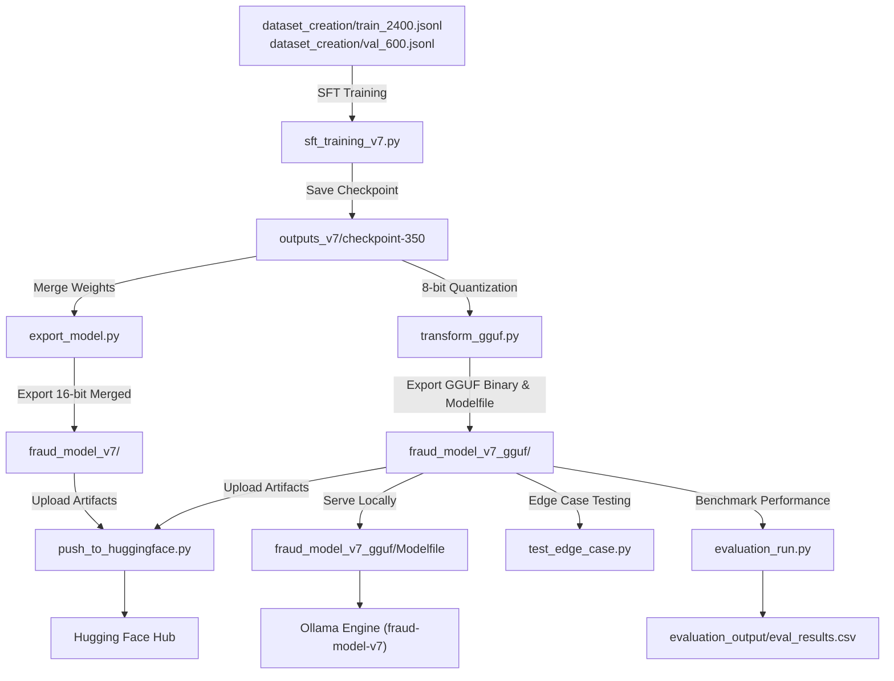

# 🛡️ Custom Fraud Analysis Engine

<p align="left">
  
  
  
  
</p>

An end-to-end pipeline for fine-tuning **Llama-3.2-1B-Instruct** on domain-specific transaction fraud datasets using **Unsloth**. This repository covers dataset formatting, low-rank adaptation (LoRA) training, 8-bit (`Q8_0`) GGUF model quantization, automated evaluation benchmarking against base models, edge-case validation, and deployment via Ollama and Hugging Face Hub.

---

## 🔄 End-to-End Pipeline Architecture



---

## 🎯 Sample Model Output

The fine-tuned model enforces a strict, four-step chain-of-thought reasoning framework to evaluate transaction signals prior to issuing a final risk decision:

```text
### Input Query:
U-1193821 attempting rapid successive 4.99 USD payments (x6). IP is Proxy/Relay. Singapore, 03:45 AM. Mobile (new) used.

### Fine-Tuned Model Inference:
Step 1 - Context: U-1193821 attempted rapid successive 4.99 USD transfers from Singapore at 03:45 AM.
Step 2 - Anomaly Detection: Flagged IP (Proxy/Relay), device mismatch (Mobile (new)), and unusual velocity detected.
Step 3 - Risk Assessment: Velocity pattern and anonymized IP indicate high likelihood of automated testing or account takeover.
Step 4 - Decision: HIGH RISK — Transaction blocked and flagged for manual review.

```

---

## 📂 Project Structure

* **`dataset_creation/`**: Directory containing dataset generators and train/validation splits (`train_2400.jsonl` and `val_600.jsonl`).
* **`fraud_model_v7_gguf/`**: Directory containing the quantized 8-bit (`Q8_0`) GGUF model binary alongside its target Ollama `Modelfile`.
* **`evaluation_output/`**: Directory storing output evaluation CSVs (`eval_results.csv`).
* **`sft_training_v7.py`**: Handles dataset loading, chat template mapping, response-only token masking, LoRA injection, and 4-bit SFT execution using Unsloth.
* **`export_model.py`**: Merges LoRA adapters back into the 16-bit base weights locally into `fraud_model_v7/`.
* **`transform_gguf.py`**: Quantizes model weights into 8-bit (`Q8_0`) GGUF binaries for edge and Ollama execution.
* **`evaluation_run.py`**: Runs a 600-sample automated evaluation comparing `llama3.2:latest` against `fraud-model-v7` across Exact Match accuracy and Cosine Semantic Similarity.
* **`test_edge_case.py`**: Evaluates model responses against complex high-value domestic transfers, proxy micro-transactions, and foreign IPs.
* **`push_to_huggingface.py`**: Uploads local merged weights and GGUF binaries to Hugging Face Hub (`MaxwellMensah/fraud_model_v7`).
* **`assets/`**: Repository diagrams and evaluation screenshots.

---

## 📋 Data Format Specification

The dataset split files (`train_2400.jsonl` and `val_600.jsonl`) adhere to the standard multi-turn `messages` JSON Lines schema:

```json
{
  "messages": [
    {
      "role": "system",
      "content": "You are a fraud detection expert. Analyze transactions using step-by-step reasoning."
    },
    {
      "role": "user",
      "content": "U-8916730 attempting 12,500.00 USD transfer. IP is Corporate Network. Toronto, afternoon. Desktop (saved) used."
    },
    {
      "role": "assistant",
      "content": "Step 1 - Context: U-8916730 initiated a 12,500.00 USD payment from Toronto at afternoon.\nStep 2 - Anomaly Detection: All signals clean. IP (Corporate Network) and device (Desktop (saved)) match profile. Normal timing.\nStep 3 - Risk Assessment: Low risk due to stable location history and verified business network.\nStep 4 - Decision: LOW RISK — Transaction approved."
    }
  ]
}

```

---

## 📊 Evaluation & Benchmarks

Model performance is evaluated on a 600-sample unseen validation split (`val_600.jsonl`) comparing the base model against the fine-tuned checkpoint (`fraud-model-v7`). Semantic similarity is computed using `nomic-embed-text` embeddings.

| Model Variant | Risk Label Exact Match (%) | Semantic Similarity Score (0.0 - 1.0) |
| --- | --- | --- |
| **Base Llama 3.2 (1B)** | ~38.4% | ~0.7840 |
| **Fine-Tuned (`fraud-model-v7`)** | **76.2%** | **0.9822** |

---

## ⚙️ Prerequisites & Setup

1. **Install Dependencies:**

```bash
pip install unsloth python-dotenv huggingface_hub torch datasets trl transformers ollama pandas tqdm
```

2. **Environment Setup:**
Create a `.env` file in the project root:

```env
HF_TOKEN=your_huggingface_write_token
```

---

## 🚀 Execution Workflow

Execute the pipeline scripts sequentially:

### Step 1: Supervised Fine-Tuning

```bash
python3 sft_training_v7.py
```

* **Input:** `dataset_creation/train_2400.jsonl` & `dataset_creation/val_600.jsonl`
* **Output:** LoRA adapter checkpoint in `outputs_v7/checkpoint-350`

### Step 2: Export 16-bit Merged Weights

```bash
python3 export_model.py
```

* **Output:** Full 16-bit merged weights saved to `fraud_model_v7/`

### Step 3: Quantize to 8-bit GGUF

```bash
python3 transform_gguf.py
```

* **Output:** 8-bit quantized GGUF binary saved inside `fraud_model_v7_gguf/`

### Step 4: Local Ollama Registration

```bash
ollama create fraud-model-v7 -f fraud_model_v7_gguf/Modelfile
```
---

### Step 5: Edge Testing & Quantitative Benchmarking

1. **Qualitative Edge-Case Validation:** Run fast sanity checks on deceptive or adversarial prompts to inspect model reasoning, catch hallucinations early, and determine if the checkpoint is ready for full testing:

```bash
python3 test_edge_case.py
```

2. **Quantitative Evaluation:** Once edge checks pass, run the 600-sample benchmark harness to calculate exact-match accuracy and semantic similarity metrics:

```bash
python3 evaluation_run.py
```

* **Output:** Detailed performance analytics saved to `evaluation_output/eval_results.csv`.

---

### Step 6: Deploy to Hugging Face Hub

```bash
python3 push_to_huggingface.py
```

* **Repository:** [MaxwellMensah/fraud_model_v7](https://huggingface.co/MaxwellMensah/fraud_model_v7)

---

## 💻 Local Ollama Inference

Test your deployed local model directly via the command line:

```bash
ollama run fraud-model-v7 "U-8916730 attempting 12,500.00 USD transfer. IP is Corporate Network. Toronto, afternoon."
```
